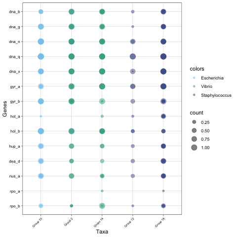
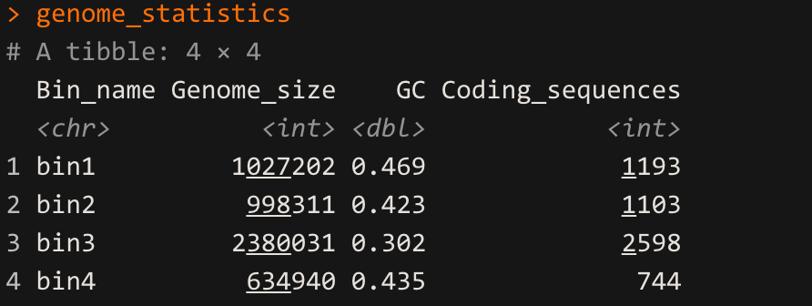

# Bin tools

Here are some scripts to do stuff with your bins.

- [Create bubble plots](https://github.com/mirnavazquez/Bin_visualization/blob/main/R/Bubble_plot.R)
- [Calculate genome statistics](https://github.com/mirnavazquez/Bin_visualization/blob/main/R/2021_11_08-genome_stats.R)

# Bubble plot example

# Statistics

